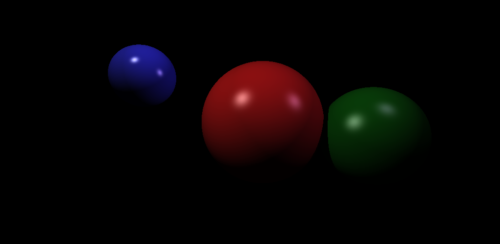

# Разработка 3D-рендерера на Java и JavaScript (вариативная часть)

## Введение

Ray Tracing (трассировка лучей) — это алгоритм рендеринга трёхмерных сцен, который симулирует физическое поведение света. В отличие от растеризации, он вычисляет реалистичное освещение, тени и отражения путём математического отслеживания пути каждого луча света.

В данной работе реализован полноценный ray tracer на языке Java, охватывающий все ключевые этапы курса: от математических основ до расчёта освещения с тенями.

## Архитектура проекта

Проект состоит из 6 независимых классов, каждый из которых отвечает за одну концепцию:

- **Vec3.java** - 3D-вектор: сложение, вычитание, dot product, нормализация
- **Ray.java** - Луч: начало + направление, вычисление точки по параметру t
- **Material.java** - Материал объекта: базовый цвет и коэффициенты модели Фонга
- **Sphere.java** - Сфера: пересечение с лучом, вычисление нормали к поверхности
- **Light.java** - Точечный источник света: позиция в пространстве и интенсивность (RGB)
- **Raytracer.java** - Главный класс: камера, сцена, трассировка, освещение, вывод PNG

## Пошаговое руководство

### Шаг 1 — Математическая основа: класс Vec3

Первый и важнейший шаг — реализация трёхмерного вектора. Он используется повсюду: для координат точек, направлений лучей, нормалей к поверхностям и значений цветов (RGB).

Ключевые операции, которые необходимо реализовать:
-	Сложение и вычитание векторов (add, sub)
-	Умножение на скаляр (scale) — изменение длины вектора
-	Покомпонентное умножение (multiply) — смешивание цветов
-	Скалярное произведение (dot product) — для вычисления углов
-	Нормализация (normalize) — получение вектора единичной длины

Пример вычисления нормали в точке на сфере:
```
Vec3 normal = point.sub(center).normalize();
```

### Шаг 2 — Луч и камера

Луч (Ray) описывается уравнением: P(t) = origin + t * direction, где t — вещественный параметр. Каждый пиксель изображения соответствует одному лучу, выпущенному из точки камеры.

Перевод пикселя (px, py) в направление луча:
```
double ndcX = (2.0 * (px + 0.5) / WIDTH  - 1.0) * aspectRatio * scale;
double ndcY = (1.0 - 2.0 * (py + 0.5) / HEIGHT) * scale;
Vec3 direction = new Vec3(ndcX, ndcY, -1).normalize();
```
Угол поля зрения (FOV) определяет, насколько «широко» видит камера. Мы используем 60° (PI/3).

### Шаг 3 — Пересечение луча со сферой

Это ключевой алгоритм видимости. Подставляем уравнение луча в уравнение сферы и получаем квадратное уравнение:
```
t²(D·D) + 2t(D·(O-C)) + (O-C)·(O-C) - r² = 0
```

Дискриминант определяет результат:
-	discriminant < 0 — луч прошёл мимо сферы
-	discriminant = 0 — луч касается сферы
-	discriminant > 0 — луч пересекает сферу в двух точках

Берём наименьшее положительное значение t — это ближайшая к камере точка пересечения. Если таких нет, луч ничего не задел.

## Шаг 4 — Освещение по модели Фонга

Модель Фонга (Phong Shading) разбивает освещение на три составляющие, которые суммируются для каждого источника света:

Формула модели Фонга
- Ambient  = ka × ia × color (фоновый свет)
- Diffuse  = kd × id × max(0, N·L) × color (рассеянный свет)
- Specular = ks × is × max(0, V·R)^shininess (зеркальный блик)
- Итоговый цвет = Ambient + Σ (Diffuse + Specular) для каждого источника

Где N — нормаль к поверхности, L — вектор к источнику света, V — вектор к камере, R — вектор отражения (R = 2(N·L)N − L). Параметры ka, kd, ks задаются в материале каждой сферы индивидуально.

## Шаг 5 — Тени (Shadow Rays)
Для каждой освещённой точки бросаем дополнительный "теневой луч" в направлении источника света. Если этот луч пересекает другой объект сцены раньше, чем достигает источника — точка находится в тени и свет не учитывается.

Реализация проверки тени:
```
Vec3 toLight = light.position.sub(point);
double distToLight = toLight.length();
Ray shadowRay = new Ray(point, toLight);
// Если t > 0 и t < distToLight — объект загораживает свет
```

Важная деталь: начало теневого луча смещается на epsilon (0.001) от поверхности, чтобы избежать самопересечения из-за погрешности вычислений с плавающей точкой.

## Шаг 6 — Компоновка сцены и вывод PNG
Сцена задаётся программно: три сферы с индивидуальными материалами и два источника света для более реалистичного освещения.

Пример задания материала синей сферы:
```
new Material(new Vec3(0.2, 0.2, 0.9),  // цвет
             0.1,  // ka (фоновый)
             0.6,  // kd (диффузный)
             0.8,  // ks (зеркальный)
             60)   // shininess (острота блика)
```

Финальный цвет каждого пикселя ограничивается диапазоном [0,1] (clamp) и переводится в формат RGB [0–255] для записи в PNG-файл через стандартный Java API: BufferedImage + ImageIO.


## Запуск проекта
Для компиляции и запуска достаточно стандартного JDK (Java 11+). Никаких дополнительных библиотек не требуется.

```
# 1. Создать папку для скомпилированных классов
mkdir -p out

# 2. Скомпилировать все .java файлы
javac -d out src/*.java

# 3. Запустить — создаст файл raytracer_output.png
java -cp out Raytracer
```

Время рендеринга для изображения 1024×500 пикселей составляет менее 1 секунды на современном компьютере.

## Результат и итоги
В результате работы была создана полноценная реализация ray tracer на чистом Java без сторонних библиотек. На рисунке ниже показан итоговый результат рендеринга:

 
## Реализованные концепции
•	Математика векторов: dot product, нормализация, отражение
•	Камера с настраиваемым полем зрения (FOV) и соотношением сторон
•	Алгоритм пересечения луча со сферой (квадратное уравнение)
•	Модель освещения Фонга: ambient + diffuse + specular
•	Тени через теневые лучи (shadow rays)
•	Несколько источников света и сфер с разными материалами
•	Вывод результата в PNG через стандартный Java API

## Ключевые выводы
Ray tracing — это элегантный алгоритм, который при небольшом объёме кода (~200 строк) воспроизводит реалистичные физические явления: освещение, блики, тени. Модель Фонга отлично демонстрирует, как аппроксимировать сложную физику простыми математическими формулами.

