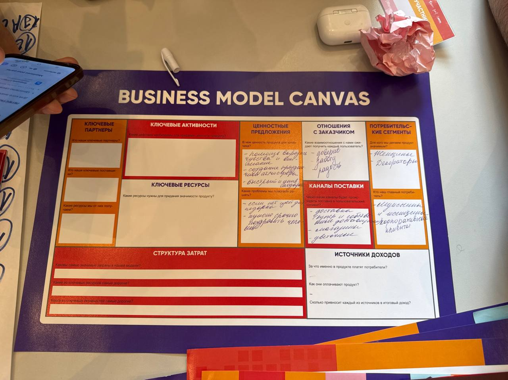
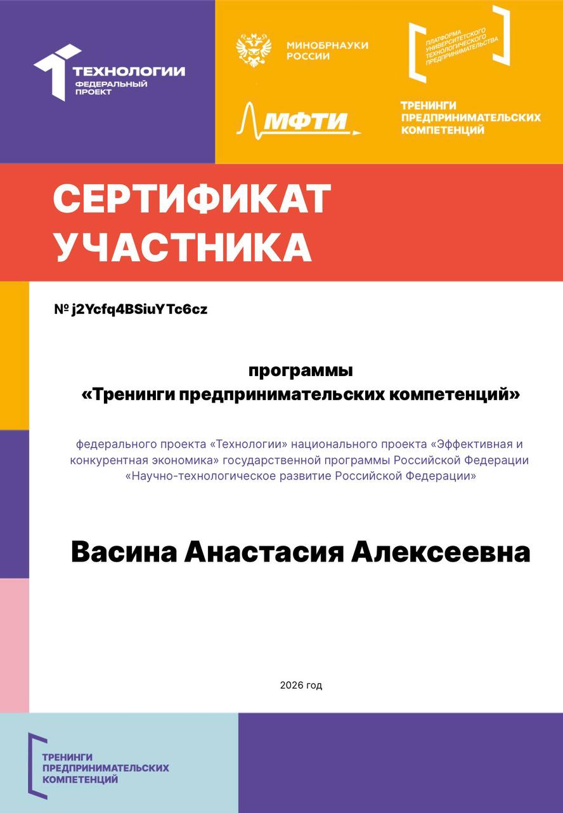

# Отчёт о взаимодействии с организацией-партнёром

## Мероприятие: Тренинг предпринимательской компетенции  
**Дата участия:** 13 мая 2026 г. 
**Формат:** очное участие  
**Время взаимодействия:** ~6 часа  

## Цель участия

Принять участие в тренинге, чтобы:
- прокачать свои бизнес-навыки;
- найти рабочую тему и проверить идею;
- как продвинуть свой продукт;
- как разработать бизнес-модель.

## Что было сделано и мои полученны знания:

Во время мероприятия я:

- получила практические навыки составления бизнес-плана;
- работала в команде и презентации проекта;
- взаимодействовала с экспертами и предпринимателями;
- разобрала реальные кейсы и обсудила способы продвижения продукта.

## Вывод
В результате прохождения тренинга STARTUP HUB были получены практические знания и навыки в области предпринимательства и разработки стартап-проектов. Тренинг позволил лучше понять этапы создания и продвижения бизнес-идеи, а также развить навыки командной работы, анализа проектов и составления бизнес-плана. Полученный опыт может быть использован для дальнейшей реализации собственных предпринимательских инициатив и профессионального развития.

|||

